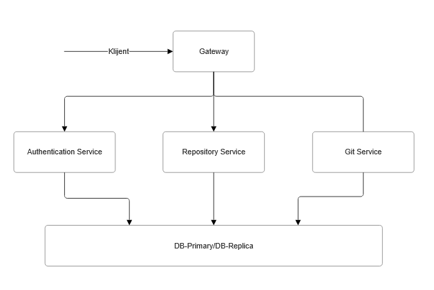

# github-clone

Pojednostavljeni backend GitHuba napravljen kao mikroservisna aplikacija. Projekt je rađen za kolegij Raspodijeljeni sustavi (FIPU).

Korisnik se može registrirati i prijaviti, kreirati repozitorije (javne ili privatne), inicijalizirati git repozitorij na disku te pregledavati grane, commitove i datoteke. Sve se pokreće lokalno kroz Docker Compose.

## Arhitektura




| Servis | Zadatak | Tehnologija |
|---|---|---|
| `gateway` | jedina ulazna točka, rutiranje, rate limiting | nginx |
| `auth-service` | registracija, prijava, izdavanje JWT tokena | FastAPI, bcrypt, python-jose |
| `repo-service` | CRUD nad metapodacima repozitorija, provjera prava pristupa | FastAPI, psycopg2 |
| `git-service` | rad s bare git repozitorijima na disku | FastAPI (async), GitPython, httpx |
| `db-primary` | PostgreSQL baza | PostgreSQL 15 |
| `db-replica` | streaming replika primarne baze | PostgreSQL 15 |

Servisi međusobno ne dijele stanje osim baze. JWT token potpisuje `auth-service`, a ostali servisi ga provjeravaju sami pomoću zajedničkog `SECRET_KEY`, bez poziva prema `auth-serviceu`.

`git-service` nema pristup bazi. Prije svake operacije pita `repo-service` smije li korisnik čitati ili pisati u repozitorij (`/internal/repositories/{id}/access`). Taj endpoint nije izložen kroz gateway.

## Pokretanje

Potrebno: Docker i Docker Compose.

```bash
cp .env.example .env
```

U `.env` upisati vrijednosti:

| Varijabla | Opis |
|---|---|
| `POSTGRES_USER`, `POSTGRES_PASSWORD`, `POSTGRES_DB` | pristup bazi |
| `REPLICATION_PASSWORD` | lozinka korisnika `replicator` za repliku |
| `SECRET_KEY` | ključ za potpis JWT tokena |
| `TIMING` | `1` uključuje ispis mjerenja vremena u git-serviceu, zadano `0` |

```bash
docker compose up -d --build
```

API je dostupan na `http://localhost:8080`. Stanje servisa:

```bash
docker compose ps
curl http://localhost:8080/health
```

Napomene:

- nakon promjene koda servis treba ponovno izgraditi: `docker compose up -d --build <servis>`
- `db/init.sql` se izvršava samo kad je volumen baze prazan, `docker compose down -v` briše sve podatke
- `db/replication.sh` mora imati LF završetke redova (riješeno kroz `.gitattributes`)

## API

Svi endpointi osim registracije i prijave traže zaglavlje `Authorization: Bearer <token>`.

### Auth

| Metoda | Putanja | Opis |
|---|---|---|
| POST | `/api/auth/register` | registracija (`username`, `email`, `password`) |
| POST | `/api/auth/login` | prijava, vraća `access_token` (vrijedi 60 min) |

### Repozitoriji

| Metoda | Putanja | Opis |
|---|---|---|
| POST | `/api/repositories` | novi repozitorij (`name`, `description`, `is_private`) |
| GET | `/api/repositories` | repozitoriji prijavljenog korisnika |
| GET | `/api/repositories/{id}` | jedan repozitorij |
| PATCH | `/api/repositories/{id}` | izmjena `description` / `is_private` |
| DELETE | `/api/repositories/{id}` | brisanje |

Privatni repozitorij tuđem korisniku vraća `404`, a ne `403`, da se ne otkrije da postoji.

### Git

| Metoda | Putanja | Opis |
|---|---|---|
| POST | `/api/repos/init` | inicijalizira bare git repozitorij (`repo_id`) |
| GET | `/api/repos/{id}/branches` | grane |
| GET | `/api/repos/{id}/commits?branch=master&limit=20` | commitovi na grani |
| GET | `/api/repos/{id}/tree?branch=master&path_prefix=` | sadržaj direktorija |

### Primjer

```bash
curl -X POST http://localhost:8080/api/auth/register \
  -H "Content-Type: application/json" \
  -d '{"username":"ana","email":"ana@example.com","password":"lozinka"}'

TOKEN=$(curl -s -X POST http://localhost:8080/api/auth/login \
  -H "Content-Type: application/json" \
  -d '{"username":"ana","password":"lozinka"}' | jq -r .access_token)

REPO_ID=$(curl -s -X POST http://localhost:8080/api/repositories \
  -H "Authorization: Bearer $TOKEN" -H "Content-Type: application/json" \
  -d '{"name":"test","is_private":true}' | jq -r .id)

curl -X POST http://localhost:8080/api/repos/init \
  -H "Authorization: Bearer $TOKEN" -H "Content-Type: application/json" \
  -d "{\"repo_id\":\"$REPO_ID\"}"

curl http://localhost:8080/api/repos/$REPO_ID/branches -H "Authorization: Bearer $TOKEN"
```

## Otpornost i skaliranje

**Rate limiting.** Gateway ograničava prijavu i registraciju na 5 zahtjeva u minuti po IP adresi (burst 3), a ostale rute na 20 zahtjeva u sekundi (burst 10). Prekoračenje vraća `429`.

**Retry.** Poziv `git-service → repo-service` ponavlja se do 3 puta s eksponencijalnim čekanjem (100 ms, 200 ms), i to samo kod mrežne greške ili `503`. Poziv je čitanje, pa ponavljanje nema nuspojava.

**Replikacija baze.** `db-replica` se pri prvom pokretanju klonira s primarne baze (`pg_basebackup`) i dalje prima promjene kroz WAL streaming. Stanje replikacije:

```bash
docker compose exec db-primary psql -U <POSTGRES_USER> -d <POSTGRES_DB> \
  -c "SELECT client_addr, state FROM pg_stat_replication;"
```

**Health checkovi.** Svaki servis ima `/health` endpoint koji Docker periodički provjerava. Nginx neovisno o tome prati stvarne zahtjeve: ako instanca dvaput ne odgovori unutar 10 sekundi, 10 sekundi joj ne šalje promet (`max_fails=2`, `fail_timeout=10s`).

**Više instanci.** Servisi su bez stanja pa se mogu pokrenuti u više kopija, nginx tada raspoređuje zahtjeve između njih:

```bash
docker compose up -d --scale repo-service=3
docker compose restart gateway
```

`git-service` se može skalirati jer sve instance dijele isti volumen `/repos`.

## Async i mjerenja

`git-service` je napisan asinkrono: poziv prema `repo-serviceu` ide kroz jedan dijeljeni `httpx.AsyncClient`, a blokirajuće GitPython operacije izvršavaju se u threadpoolu kroz `asyncio.to_thread`. `auth-service` i `repo-service` su sinkroni, FastAPI ih izvršava u svom threadpoolu.

Mjereno s `ab -n 2000` na `/api/repos/{id}/branches` (poziv prolazi kroz git-service i repo-service), s privremeno isključenim rate limitom:

| Konkurentnost | sync git-service | async git-service |
|---|---|---|
| 1 | 95 req/s | 158 req/s |
| 160 | 279 req/s | 288 req/s |

Razlika pri konkurentnosti 1 ne dolazi od asinkronosti, nego od toga što sinkrona verzija za svaki poziv otvara novu TCP konekciju, a `AsyncClient` ih ponovno koristi (keep-alive). Pri većoj konkurentnosti razlika gotovo nestaje jer usko grlo postaje `repo-service`. Detaljna analiza je u zasebnom dokumentu.

Za ispis vremena pojedinih koraka postaviti `TIMING=1` u `.env` i ponovno pokrenuti `git-service`.

## Ograničenja

- Nema `git push` ni kloniranja preko HTTP-a. Repozitorij se može inicijalizirati i čitati, ali sadržaj se u njega ne može poslati kroz API.
- Replika se ne koristi za čitanje i nema automatskog failovera. Ako primarna baza padne, servisi ne prelaze sami na repliku.
- Docker ponovno pokreće kontejner samo kad proces padne, ne i kad je health check neuspješan.
- `repo-service` i `auth-service` otvaraju novu konekciju prema bazi za svaki zahtjev.
- Brisanje repozitorija u `repo-serviceu` ne briše git repozitorij s diska.